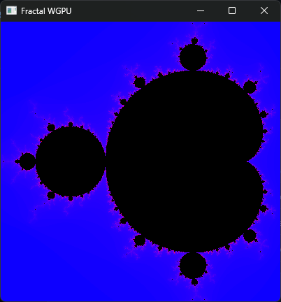

# Mandelbrot WGPU

## About

While the purpose of the program is to display a fractal, the purpose of me writing the code was to learn a bit about the `wgpu` API.

## Usage as an executable

This program renders a mandelbrot fractal in real time and allows you to view different parts of it and zoom in and out. You can use the arrow keys to move the visible part up, down, left or right. In order to zoom in use period (`.`) and to zoom out comma (`,`).



## Installation

### Building from source

1. Install the rust toolchain. You can follow the instructions at <http://rustup.rs>.
2. Checkout the repository using `git clone https://github.com/pacman82/fractal-wgpu.git`.
3. Navigate into the checked out repository and run `cargo build --release`. After it runs through you will find the executable in the `target/release` subfolder. Alternatively you can build and run the program in one go by executing `cargo run --release` instead.

## See the mandelbrot in a browser

Part of the interesst for me in this project came, what it would take to have the same backend code run in both an executable and in a browser. You can see the mandelbrot in the browser after building it with WASM pack.

```shell
wasm-pack build web --target web
```

Then navigate to `fractal.html` and open it in a browser.